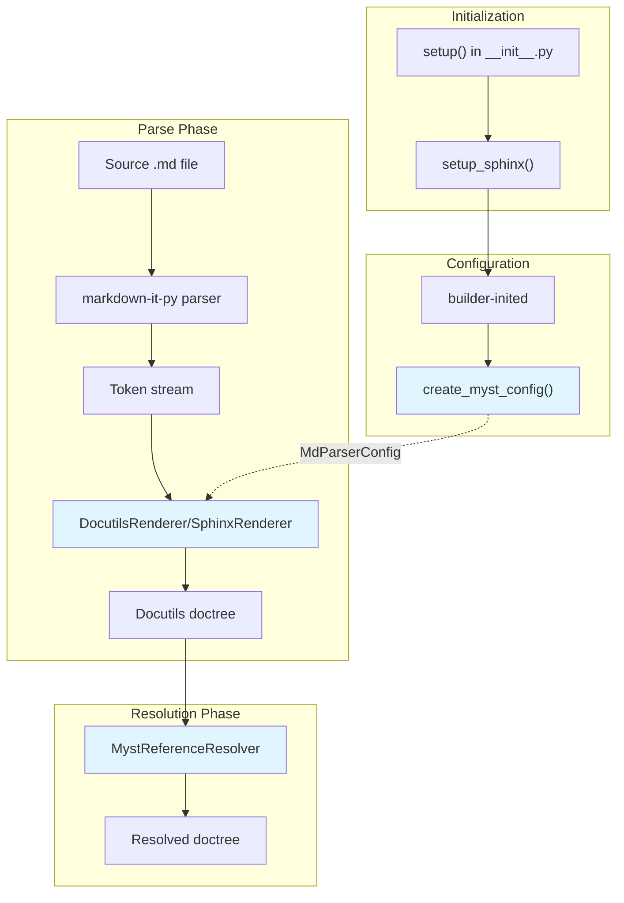

# AGENTS.md

This file provides guidance for AI coding agents working on the **MyST-Parser** repository.

## Project Overview

MyST-Parser is a Sphinx extension and docutils parser for the MyST (Markedly Structured Text) Markdown flavor. It provides:

- An extended [CommonMark](https://commonmark.org)-compliant parser using [`markdown-it-py`](https://markdown-it-py.readthedocs.io/)
- A [docutils](https://docutils.sourceforge.io/) renderer that converts markdown-it tokens to docutils nodes
- A [Sphinx](https://www.sphinx-doc.org) extension for using MyST Markdown in Sphinx documentation

MyST is designed for technical documentation and publishing, offering a rich and extensible flavor of Markdown with support for roles, directives, and cross-references.

## Repository Structure

```
pyproject.toml          # Project configuration and dependencies
tox.ini                 # Tox test environment configuration

myst_parser/            # Main source code
├── __init__.py         # Package init with Sphinx setup() entry point
├── config/             # Configuration dataclasses
│   ├── main.py         # MdParserConfig dataclass
│   └── dc_validators.py # Dataclass field validators
├── parsers/            # Parser implementations
│   ├── sphinx_.py      # Sphinx parser (MystParser)
│   ├── docutils_.py    # Docutils parser and CLI tools
│   ├── mdit.py         # markdown-it-py setup and plugins
│   ├── directives.py   # Directive parsing utilities
│   └── options.py      # Option parsing for directives
├── mdit_to_docutils/   # Token-to-docutils rendering
│   ├── base.py         # DocutilsRenderer (main renderer)
│   ├── sphinx_.py      # SphinxRenderer (Sphinx-specific)
│   ├── transforms.py   # Docutils transforms
│   └── html_to_nodes.py # HTML-to-docutils conversion
├── sphinx_ext/         # Sphinx extension components
│   ├── main.py         # setup_sphinx() and config creation
│   ├── directives.py   # Custom Sphinx directives
│   ├── myst_refs.py    # Reference resolver post-transform
│   └── mathjax.py      # MathJax configuration
├── inventory.py        # Sphinx inventory file handling
├── mocking.py          # Mock objects for directive/role parsing
├── warnings_.py        # Warning types (MystWarnings enum)
├── cli.py              # Command-line interface
└── _compat.py          # Python version compatibility

tests/                  # Test suite
├── test_sphinx/        # Sphinx integration tests
│   ├── sourcedirs/     # Test documentation projects
│   └── test_sphinx_builds.py
├── test_renderers/     # Renderer unit tests
├── test_commonmark/    # CommonMark compliance tests
├── test_html/          # HTML output tests
├── test_docutils.py    # Docutils parser tests
└── test_anchors.py     # Heading anchor tests

docs/                   # Documentation source (MyST Markdown)
├── conf.py             # Sphinx configuration
├── index.md            # Documentation index
├── syntax/             # Syntax reference documentation
├── develop/            # Developer documentation
└── faq/                # FAQ and troubleshooting
```

## Development Commands

All commands should be run via [`tox`](https://tox.wiki) for consistency. The project uses `tox-uv` for faster environment creation.

### Testing

```bash
# Run all tests
tox

# Run a specific test file
tox -- tests/test_docutils.py

# Run a specific test function
tox -- tests/test_docutils.py::test_function_name

# Run tests with a specific Python/Sphinx version
tox -e py311-sphinx8

# Run with coverage
tox -- --cov=myst_parser

# Update regression test fixtures
tox -- --regen-file-failure --force-regen
```

### Documentation

```bash
# Build docs (clean)
tox -e docs-clean

# Build docs (incremental)
tox -e docs-update

# Build with a specific builder (e.g., linkcheck)
BUILDER=linkcheck tox -e docs-update
```

### Code Quality

```bash
# Type checking with mypy
tox -e mypy

# Linting with ruff (auto-fix enabled)
tox -e ruff-check

# Formatting with ruff
tox -e ruff-fmt

# Run pre-commit hooks on all files
pre-commit run --all-files
```

## Code Style Guidelines

- **Formatter/Linter**: Ruff (configured in `pyproject.toml`)
- **Type Checking**: Mypy with strict settings (configured in `pyproject.toml`)
- **Pre-commit**: Use pre-commit hooks for consistent code style

### Best Practices

- **Type annotations**: Use complete type annotations for all function signatures. Use `TypedDict` for structured dictionaries, dataclasses for configuration.
- **Docstrings**: Use Sphinx-style docstrings (`:param:`, `:return:`, `:raises:`). Types are not required in docstrings as they should be in type hints.
- **Function Signatures**: Use `/` and `*` to enforce positional-only and keyword-only arguments where appropriate
- **Pure functions**: Where possible, write pure functions without side effects.
- **Error handling**: Use `MystWarnings` enum for warning types. Use `create_warning()` for user-facing warnings.
- **Testing**: Write tests for all new functionality. Use `pytest-regressions` for output comparison tests.

### Docstring Example

```python
def parse_directive_text(
    directive_class: type[Directive],
    first_line: str,
    content: str,
    *,
    validate_options: bool = True,
) -> tuple[list[str], dict[str, Any], list[str], int]:
    """Parse directive text into its components.

    :param directive_class: The directive class to parse for.
    :param first_line: The first line (arguments).
    :param content: The directive content.
    :param validate_options: Whether to validate options against the directive spec.
    :return: Tuple of (arguments, options, body_lines, body_offset).
    :raises MarkupError: If the directive text is malformed.
    """
    ...
```

## Testing Guidelines

### Test Structure

- Tests use `pytest` with fixtures from `conftest.py` files
- Sphinx integration tests are in `tests/test_sphinx/`
- Test source directories are in `tests/test_sphinx/sourcedirs/`
- Regression testing uses `pytest-regressions` for output comparison
- Use `pytest-param-files` for parameterized file-based tests

### Writing Tests

1. For Sphinx integration tests, create a source directory in `tests/test_sphinx/sourcedirs/`
2. Use `sphinx-pytest` fixtures for Sphinx application testing
3. Use `file_regression` fixture for comparing output against stored fixtures

### Test Best Practices

- **Test coverage**: Write tests for all new functionality and bug fixes
- **Isolation**: Each test should be independent and not rely on state from other tests
- **Descriptive names**: Test function names should describe what is being tested
- **Regression testing**: Use `file_regression.check()` for complex output comparisons
- **Parametrization**: Use `@pytest.mark.parametrize` for multiple test scenarios
- **Fixtures**: Define reusable fixtures in `conftest.py`

### Example Test Pattern

```python
import pytest

@pytest.mark.sphinx(
    buildername="html",
    srcdir="path/to/sourcedir",
)
def test_example(app, status, warning, get_sphinx_app_output):
    app.build()
    assert "build succeeded" in status.getvalue()
    warnings = warning.getvalue().strip()
    assert warnings == ""
```

## Pull Request Requirements

When submitting changes:

1. **Description**: Include a meaningful description or link explaining the change
2. **Tests**: Include test cases for new functionality or bug fixes
3. **Documentation**: Update docs if behavior changes or new features are added
4. **Changelog**: Update `CHANGELOG.md` under the appropriate section
5. **Code Quality**: Ensure `pre-commit run --all-files` passes

## Architecture Overview

### Parsing Pipeline

The MyST parser follows a three-stage pipeline:

```
MyST Markdown → markdown-it tokens → docutils AST → Sphinx/HTML output
```

1. **Markdown Parsing** (`myst_parser/parsers/mdit.py`): Uses `markdown-it-py` with MyST plugins to parse Markdown into tokens
2. **Token Rendering** (`myst_parser/mdit_to_docutils/`): Converts markdown-it tokens to docutils nodes
3. **Sphinx Integration** (`myst_parser/sphinx_ext/`): Integrates with Sphinx for documentation builds

### Key Components

#### Configuration (`myst_parser/config/main.py`)

The `MdParserConfig` dataclass centralizes all MyST configuration options:

- Defines all `myst_*` configuration values with types and defaults
- Uses dataclass validators for type checking
- Sphinx config values are auto-registered with `myst_` prefix

#### Parsers (`myst_parser/parsers/`)

- `MystParser` (in `sphinx_.py`): The Sphinx parser class that integrates with Sphinx's build system
- `Parser` (in `docutils_.py`): The standalone docutils parser for non-Sphinx use
- `create_md_parser()` (in `mdit.py`): Factory function to create configured markdown-it-py instances

#### Renderers (`myst_parser/mdit_to_docutils/`)

- `DocutilsRenderer` (in `base.py`): Base renderer that converts tokens to docutils nodes. Contains render methods for each token type (e.g., `render_heading`, `render_paragraph`).
- `SphinxRenderer` (in `sphinx_.py`): Extends `DocutilsRenderer` with Sphinx-specific functionality (e.g., cross-references, domains).

#### Sphinx Extension (`myst_parser/sphinx_ext/`)

- `setup_sphinx()` (in `main.py`): Registers the parser, config values, and transforms with Sphinx
- `MystReferenceResolver` (in `myst_refs.py`): Post-transform that resolves MyST-style references
- Custom directives like `figure-md` (in `directives.py`)

### Sphinx Integration Flow



## Key Files

- `pyproject.toml` - Project configuration, dependencies, and tool settings
- `myst_parser/__init__.py` - Package entry point with `setup()` for Sphinx
- `myst_parser/config/main.py` - `MdParserConfig` dataclass with all configuration options
- `myst_parser/parsers/sphinx_.py` - `MystParser` class for Sphinx integration
- `myst_parser/mdit_to_docutils/base.py` - `DocutilsRenderer` with token-to-node rendering
- `myst_parser/sphinx_ext/main.py` - `setup_sphinx()` function for Sphinx setup
- `myst_parser/warnings_.py` - `MystWarnings` enum for warning types

## Debugging

- Build docs with `-T` flag for full tracebacks: `tox -e docs-clean --  -T ...`
- Use `myst-docutils-html` CLI for standalone parsing without Sphinx
- Check `docs/_build/` for build outputs
- Use `tox -- -v --tb=long` for verbose test output with full tracebacks
- Set `myst_debug_match = True` in Sphinx config to log matched syntax

## Common Patterns

### Adding a New Syntax Extension

1. Create a markdown-it-py plugin or use an existing one from `mdit-py-plugins`
2. Register it in `myst_parser/parsers/mdit.py`
3. Add configuration option in `MdParserConfig` if needed
4. Add render method in `DocutilsRenderer` (e.g., `render_my_syntax`)
5. Document in `docs/syntax/`
6. Add tests in `tests/`

### Adding a Configuration Option

1. Add field to `MdParserConfig` in `myst_parser/config/main.py`
2. Add validator if needed in `myst_parser/config/dc_validators.py`
3. Document in `docs/configuration.md`
4. Add tests for the new option

### Adding a Sphinx Directive

1. Create directive class in `myst_parser/sphinx_ext/directives.py`
2. Register in `setup_sphinx()` in `myst_parser/sphinx_ext/main.py`
3. Document in appropriate docs section
4. Add tests in `tests/test_sphinx/`

## Reference Documentation

- [markdown-it-py Repository](https://github.com/ExecutableBookProject/markdown-it-py)
- [markdown-it-py Documentation](https://markdown-it-py.readthedocs.io/)
- [Docutils Repository](https://github.com/live-clones/docutils)
- [Docutils Documentation](https://docutils.sourceforge.io/)
- [Sphinx Repository](https://github.com/sphinx-doc/sphinx)
- [Sphinx Extension Development](https://www.sphinx-doc.org/en/master/extdev/index.html)
